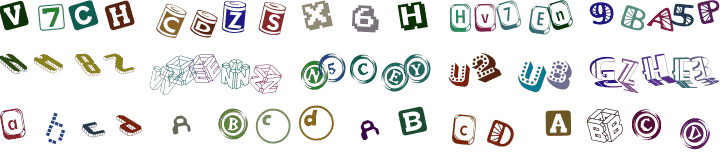

# `mobicms/captcha`

[](https://github.com/mobicms/captcha/blob/main/LICENSE)
[](https://github.com/mobicms/captcha/releases)
[](https://packagist.org/packages/mobicms/captcha)

[](https://github.com/mobicms/captcha/actions?query=workflow%3AAnalysis)
[](https://github.com/mobicms/captcha/actions?query=workflow%3ATests)
[](https://sonarcloud.io/code?id=mobicms_captcha)
[](https://sonarcloud.io/summary/overall?id=mobicms_captcha)

This library is a simple PHP CAPTCHA. Prevent form spam by generating random Captcha images.

Major features:
- lightweight and fast
- not create any temporary files
- there are many settings that allow you to change the look of the picture
- you can use your own font sets

Example:



## Installation

The preferred method of installation is via [Composer](http://getcomposer.org). Run the following
command to install the package and add it as a requirement to your project's
`composer.json`:

```bash
composer require mobicms/captcha
```

## Usage

- Display in form:

```html+php
<?php
$code = (string) new Mobicms\Captcha\Code;
$_SESSION['code'] = $code;
?>

<form method="post">
<!-- ... -->
">
<input type="text" size="5" name="code">
<!-- ... -->
</form>
```

- Check whether the entered code is correct:

```php
$result = filter_input(INPUT_POST, 'code');
$session = filter_input(INPUT_SESSION, 'code');

if ($result !== null && $session !== null) {
    if (strtolower($result) == strtolower($session)) {
        // CAPTCHA code is correct
    } else {
        // CAPTCHA code is incorrect, show an error to the user
    }
}
```


## Contributing
Contributions are welcome! Please read [Contributing][contributing] for details.

[][yagni]
[][kiss]

In our development, we follow the principles of [YAGNI][yagni] and [KISS][kiss].
The source code should not have extra unnecessary functionality and should be as simple and efficient as possible.

## License

This package is licensed for use under the MIT License (MIT).  
Please see [LICENSE][license] for more information.


## Our links
- [**mobiCMS Project**][website] website and support forum
- [**GitHub**](https://github.com/mobicms) mobiCMS project repositories
- [**Twitter**](https://twitter.com/mobicms)

[website]: https://mobicms.org
[yagni]: https://en.wikipedia.org/wiki/YAGNI
[kiss]: https://en.wikipedia.org/wiki/KISS_principle
[contributing]: https://github.com/mobicms/captcha/blob/main/.github/CONTRIBUTING.md
[license]: https://github.com/mobicms/captcha/blob/main/LICENSE
