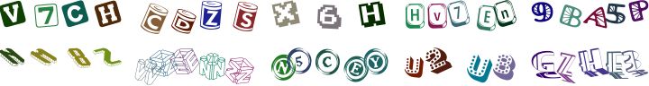

# A simple PHP CAPTCHA library

[](https://travis-ci.org/mobicms/captcha)
[](https://scrutinizer-ci.com/g/mobicms/captcha/?branch=develop)
[](https://github.styleci.io/repos/226185078)
[](https://scrutinizer-ci.com/g/mobicms/captcha/?branch=develop)

[](https://packagist.org/packages/mobicms/captcha)
[](https://packagist.org/packages/mobicms/captcha)
[](https://github.com/mobicms/captcha/releases)

Prevent form spam by generating random Captcha images.



## Install via Composer

`composer require mobicms/captcha`

## Usage

1. Display in form:

    ```html+php
    <?php
    $code = (string) new Mobicms\Captcha\Code;
    $_SESSION['code'] = $code;
    ?>

    <form method="post">
    <!-- ... -->
    ">
    <input type="text" size="5" name="code">
    <!-- ... -->
    </form>
	```

2. Check whether the entered code is correct:

    ```php
    $result = filter_input(INPUT_POST, 'code');
    $session = filter_input(INPUT_SESSION, 'code');
    
    if ($result !== null && $session !== null) {
        if (strtolower($result) == strtolower($session)) {
            // CAPTCHA code is correct
        } else {
            // CAPTCHA code is incorrect, show an error to the user
        }
    }
    ```
