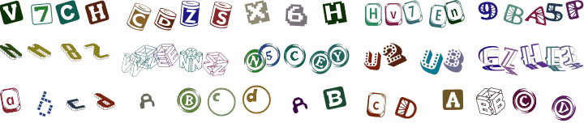

# `mobicms/captcha`

[](https://github.com/mobicms/captcha/blob/main/LICENSE)
[](https://github.com/mobicms/captcha/releases)
[](https://packagist.org/packages/mobicms/captcha)

[](https://github.com/mobicms/captcha/actions?query=workflow%3AAnalysis)
[](https://github.com/mobicms/captcha/actions?query=workflow%3ATests)
[](https://sonarcloud.io/code?id=mobicms_captcha)
[](https://sonarcloud.io/summary/overall?id=mobicms_captcha)

This library is a simple PHP CAPTCHA. Prevent form spam by generating random Captcha images.

Major features:
- lightweight and fast
- not create any temporary files
- there are many settings that allow you to change the look of the picture
- you can use your own font sets

Example:



# Installation

The preferred method of installation is via [Composer](http://getcomposer.org). Run the following
command to install the package and add it as a requirement to your project's
`composer.json`:

```bash
composer require mobicms/captcha
```

# Run DEMO
Compose and run the Docker container. Demo page available at: [http://localhost:8080](http://localhost:8080)
```bash
docker compose up -d 
``` 


# Simply usage (v.5)

- Display in form:

```php
<?php
$captcha = new Mobicms\Captcha\Image();
$_SESSION['code'] = $captcha->getCode();
?>

<form method="post">
<!-- ... -->
getImage() ?>">
<input type="text" size="5" name="code">
<!-- ... -->
</form>
```

- Sending in browser:

```php
<?php
header('Content-Type: image/png');
$captcha = new Mobicms\Captcha\Image();
echo $captcha->build();
```

- Check whether the entered code is correct:

```php
$result = filter_input(INPUT_POST, 'code');
$session = filter_input(INPUT_SESSION, 'code');

if ($result !== null && $session !== null) {
    if (strtolower($result) == strtolower($session)) {
        // CAPTCHA code is correct
    } else {
        // CAPTCHA code is incorrect, show an error to the user
    }
}
```


# Customization (v.5)
You can change CAPTCHA settings through `\Mobicms\Captcha\Image` class properties. 

## Image properties

### Image: resizing
`int $imageWidth = 190, int $imageHeight = 90`  
Keep in mind that the width of the image will affect the density of the text.  
If the characters are very creeping on top of each other and become illegible,
then increase the width of the image, reduce the length of the verification code, or the font size. 
```php
$captcha = new Mobicms\Captcha\Image();

// Set the image width (default: 190)
$captcha->imageWidth = 250;
// Set the image height (default: 90)
$captcha->imageHeight = 100;
```

### Image: default font size
`int $defaultFontSize = 30`  
This setting affects the size of all fonts used.

### Image: fonts mixer
`bool $fontMix = true`  
If this parameter is set to `TRUE` (default), a random font will be used for each character in the image.  
  
If you set it to `FALSE`, then a single, randomly selected font will be used for all characters in the image.  
  

### Image: fonts folders
`array $fontFolders`  
You can use your own set of TTF fonts. To do this, specify one or more folders in the array where .ttf font files are located.
Keep in mind that this package already has some fonts. If you plan to use them, then merge the arrays.
```php
$captcha = new Mobicms\Captcha\Image();

$captcha->fontFolders = array_merge(
    // Using built-in fonts 
    $captcha->fontFolders,

    // Specifying your font folders
    ['folder1', 'folder2']
);
```

### Image: adjust font
`array $fontsTune`  
Some fonts may have a size that looks too small or large compared to others.
In this case, you need to specify an adjustment relative to the default size.
Also, if necessary, you can force the specified font to use only uppercase or lowercase characters.

Adjustment parameters are passed to the `$fontsTune` class property as an array.  
Keep in mind that the class already has some adjustments, so if you use fonts from this package,
then combine your array of adjustments with an array of `$fontsTune` properties. 
```php
$captcha = new Mobicms\Captcha\Image();

$adjust = [
    // Specify the name of the font file
    'myfont1.ttf' => [
        // Specify the relative font size.
        // It will be summarized with the default size specified in the $defaultFontSize property
        // In this case, the font will be used: 30+16=46
        'size' => 16, // Optional
        // Forcing the use of only lowercase characters of the specified font
        'case' => \Mobicms\Captcha\Image::FONT_CASE_LOWER, // Optional
    ],

    'myfont2.ttf' => [
        // Forcing the use of only uppercase characters of the specified font
        'case' => \Mobicms\Captcha\Image::FONT_CASE_UPPER,
    ],

    'myfont3.ttf' => [
        // Font size will be decreased by 8
        'size' => -8,
    ],

    'myfont4.ttf' => [
        // Font size will be increased by 4
        'size' => 4,
    ],
];

$captcha->fontsTune = array_merge($captcha->fontsTune, $adjust);
```

## Verification code properties

### Verification code: length
`int $lengthMin = 4`, `int $lengthMax = 5`  
The length of the generated code string will be randomly between the
specified minimum and maximum values.

### Verification code: character Set
`string $characterSet = '23456789ABCDEGHJKMNPQRSTUVXYZabcdeghjkmnpqrstuvxyz'`  
In this string you can specify a set of characters that will be used randomly
when generating the verification code. Avoid using characters that can be interpreted
ambiguously, such as O (letter) and 0 (number).

### Verification code: excluded сombinations
`string $excludedCombinationsPattern = 'rn|rm|mm|ww'`  
You can use a pattern to specify combinations of adjacent characters that should not appear next to each other.
For example, **rn** can be interpreted as **m**, and so on...

### Verification code: use your own
The Image class already has the ability to generate validation code,
which will be sufficient in most use cases.
However, if necessary, you can generate the validation code yourself
and then pass string to the constructor when the `Image` class is initialized:
```php
$code = 'FooBar';
$captcha = new Mobicms\Captcha\Image($code);
```


# Contributing
Contributions are welcome! Please read [Contributing][contributing] for details.

[][yagni]
[][kiss]

In our development, we follow the principles of [YAGNI][yagni] and [KISS][kiss].
The source code should not have extra unnecessary functionality and should be as simple and efficient as possible.

# License

This package is licensed for use under the MIT License (MIT).  
Please see [LICENSE][license] for more information.


# Our links
- [**mobiCMS Project**][website] website and support forum
- [**GitHub**](https://github.com/mobicms) mobiCMS project repositories
- [**Twitter**](https://twitter.com/mobicms)

[website]: https://mobicms.org
[yagni]: https://en.wikipedia.org/wiki/YAGNI
[kiss]: https://en.wikipedia.org/wiki/KISS_principle
[contributing]: https://github.com/mobicms/captcha/blob/main/.github/CONTRIBUTING.md
[license]: https://github.com/mobicms/captcha/blob/main/LICENSE
